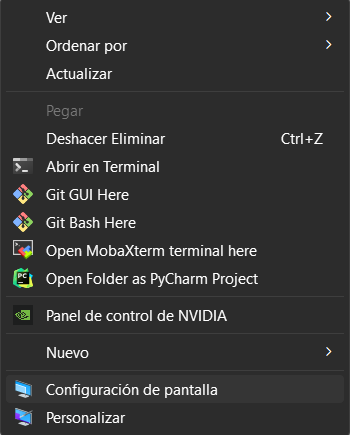

# Archer game with a Montecarlo simulation 

This program is an archer game using Montecarlo simulation.

### For use the program you should follow the next steps:
## Clone the Project

1. Go to your desktop or an empty folder and right-click to display the pop-up 
   menu where you will select the "Open Git Bash here" option. 
     
     

    

2. In the terminal, type the following command:

    `git clone https://github.com/brayooo/PseudoRandomNumberTests.git`
    And wait for it to finish cloning the entire project from the repository

3. When you finish cloning, the project folder should appear.

    

## Install required Python Libraries

If you are using windows you better use a **bash** terminal or if
you already have the configuration done of your windows cmd to works
with python, go ahead.

### Let's check that pip is installed
- Open a **bash** into the project and type:

    

      > pip show pip
    
    If you have it installed, you should see general information about this library. Like this:
    
    

    If nothing comes out, you must install pip.

    
- Install requirements:

      > pip -r install requirements.txt
    
    
    
    ### Now you're up to use the project.

## Running the Project

- Open the project with the **IDE** or **Development Environment** you want.
- You'll see the main.py file.
- You can run the file with the command
      
      > python main.py

- Or you can run the file using the run configuration of your IDE.

Perfect, if everything goes well and if you followed the steps you can see the game
running in your IDE console and the graphics stats.

## Important

- If the graph isn't display correctly (when the game are running you have to view the graph by running the stats), please verify the IDE options 
to see the matplotlib graphic correctly.
- The game is experienced lag because of the computational complexity of the pseudo-random numbers used in the algorithm. 
The team is working to improve this problem in future versions of the game :) 

## Author

- Bryan Lopez

**Simulación de Computadores - Grupo 1**